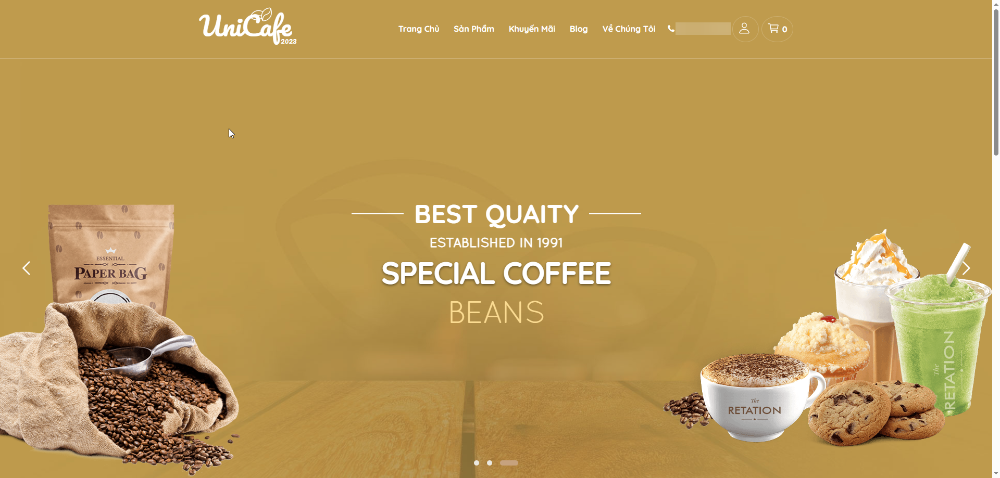

# UniCafe

Experience the rich and aromatic world of coffee at our online store.

UniCafe is a full-featured e-commerce web application for a coffee shop, built with ASP.NET MVC 5. It includes product browsing, shopping cart, online checkout with multiple payment gateways (MoMo, VNPay), blog management, and a complete admin dashboard.



## Tech Stack

- **Framework:** ASP.NET MVC 5 (.NET Framework 4.7.2)
- **ORM:** Entity Framework 6 (Code First)
- **Database:** SQL Server
- **Authentication:** ASP.NET Identity with OWIN Cookie Authentication
- **Admin Dashboard:** AdminLTE 3
- **Frontend:** Bootstrap 3, jQuery 3.6
- **Payment:** MoMo, VNPay (Sandbox)
- **DI Container:** Unity 5

## Prerequisites

- Visual Studio 2017 or later (recommended: Visual Studio 2022)
- .NET Framework 4.7.2 Developer Pack
- SQL Server (LocalDB, SQL Server Express, or Docker)

## Getting Started

### Step 1: Clone the repository

```bash
git clone https://github.com/phuchautea/UniCafe.git
cd UniCafe
```

### Step 2: Open the solution

Open `UniCafe.sln` with Visual Studio.

### Step 3: Restore NuGet packages

Visual Studio should automatically restore packages on open. If not:

1. Right-click the **Solution** in Solution Explorer
2. Select **Restore NuGet Packages**

### Step 4: Configure the database connection

Open `UniCafe/Web.config` and update the connection string to match your SQL Server instance:

**Option A: Using SQL Server Express (local)**

```xml
<add name="DefaultConnection"
     connectionString="Server=.\SQLEXPRESS;Initial Catalog=UniCafe;Integrated Security=True;"
     providerName="System.Data.SqlClient" />
```

**Option B: Using LocalDB**

```xml
<add name="DefaultConnection"
     connectionString="Server=(localdb)\MSSQLLocalDB;Initial Catalog=UniCafe;Integrated Security=True;"
     providerName="System.Data.SqlClient" />
```

**Option C: Using Docker SQL Server**

```xml
<add name="DefaultConnection"
     connectionString="Server=localhost,1433;Initial Catalog=UniCafe;User Id=sa;Password=YourPassword;"
     providerName="System.Data.SqlClient" />
```

### Step 5: Create the database

Open **Package Manager Console** in Visual Studio:

```
Tools -> NuGet Package Manager -> Package Manager Console
```

Run the following command to apply all migrations and create the database:

```
Update-Database
```

### Step 6: Run the application

Press **F5** (Debug) or **Ctrl+F5** (Run without debugging).

The application will launch in your default browser using IIS Express.

## Project Structure

```
UniCafe/
├── UniCafe.sln                    # Solution file
└── UniCafe/                       # Main project
    ├── App_Start/                 # App configuration
    │   ├── BundleConfig.cs        # CSS/JS bundling
    │   ├── FilterConfig.cs        # Global filters
    │   └── RouteConfig.cs         # URL routing
    ├── Areas/
    │   └── Admin/                 # Admin area
    │       └── Controllers/       # Admin controllers
    │           ├── ManageProductController.cs
    │           ├── ManageCategoryController.cs
    │           ├── ManageOrderController.cs
    │           ├── ManageBlogController.cs
    │           ├── ManageRoleController.cs
    │           ├── ManageUserController.cs
    │           └── StatsController.cs
    ├── Controllers/               # Public controllers
    │   ├── HomeController.cs
    │   ├── ProductController.cs
    │   ├── CartController.cs
    │   ├── OrderController.cs
    │   ├── PayController.cs
    │   ├── AccountController.cs
    │   ├── BlogController.cs
    │   └── CategoryController.cs
    ├── Models/                    # Data models
    │   ├── Product.cs
    │   ├── Category.cs
    │   ├── Order.cs
    │   ├── OrderDetail.cs
    │   ├── Blog.cs
    │   ├── CartItem.cs
    │   └── Payment.cs
    ├── Data/                      # Data access layer
    │   ├── ApplicationDbContext.cs
    │   ├── ApplicationUser.cs
    │   ├── Repository.cs          # Generic repository
    │   └── UnitOfWork.cs
    ├── Services/                  # Business services
    │   ├── CartManager.cs
    │   └── Payment/
    │       └── Momo/              # MoMo payment integration
    ├── Views/                     # Razor views
    ├── Content/                   # Static assets
    │   ├── images/                # Product images
    │   └── Layout/Admin/          # AdminLTE template
    ├── Migrations/                # EF Code First migrations
    ├── Startup.cs                 # OWIN startup
    ├── Global.asax.cs             # Application entry point
    └── Web.config                 # App configuration
```

## Features

**Customer-facing:**
- Browse products by category
- Product detail pages
- Shopping cart (add, update, remove items)
- Checkout with multiple payment methods (Cash, MoMo, VNPay)
- User registration and login
- Blog/news section

**Admin dashboard:**
- Product management (CRUD)
- Category management
- Order management
- Blog management
- User and role management
- Statistics/reports

## Payment Gateways

The application integrates with two payment gateways in **sandbox/test mode**:

- **MoMo** - Vietnamese e-wallet payment
- **VNPay** - Vietnamese bank payment gateway

Payment configuration can be found in `Web.config` under `<appSettings>`.

## License

This project is for educational purposes.
